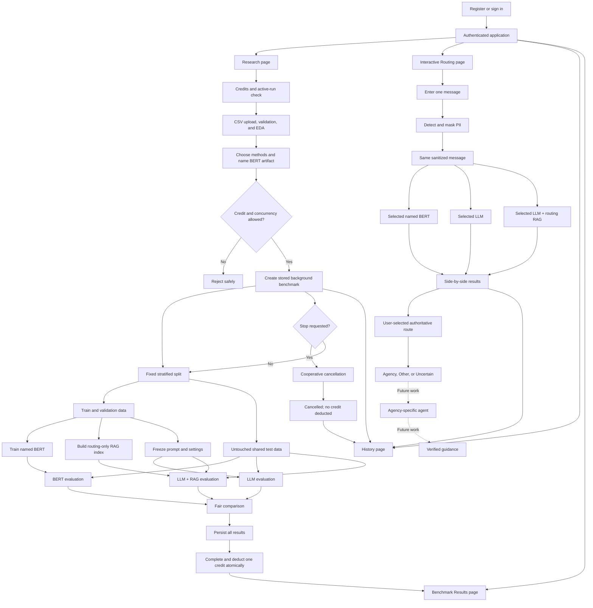

# NewStart AI Benchmark — Complete Master Prompt

Copy everything inside the prompt block and give it to Claude. This is a blueprint prompt: Claude must design the complete architecture and implementation plan first, not generate the entire application in one response.

```text
You are a senior AI software architect, machine-learning researcher, security-conscious backend engineer, and full-stack engineer.

Help me design and later build a graduate capstone project named:

NEWSTART AI BENCHMARK

The project must be scientifically reproducible, understandable to a graduate student, modular, locally testable, and suitable for later deployment to a VPS or virtual machine.

Do not implement the entire system in your first response. First produce a coherent blueprint covering architecture, database design, interfaces, workflows, security rules, experiment lifecycle, notebooks, APIs, frontend pages, background jobs, cancellation, quota enforcement, tests, and phased implementation.

==================================================
1. PROJECT PURPOSE AND RESEARCH BOUNDARY
==================================================

NewStart AI Benchmark is a research and application platform for multiclass text classification and agency routing.

The research compares approaches under identical experimental conditions:

1. A locally fine-tuned BERT classifier
2. An LLM routing classifier
3. An LLM routing classifier enhanced with RAG

Example external LLM providers include:

- Gemini
- Claude
- OpenAI

The initial NewStart AI labels are:

- USCIS
- California DMV
- SSA
- IRS
- Other / Out of Scope
- Uncertain, when a method cannot make a sufficiently reliable decision

The RAG component in the current capstone is used only to improve routing classification. It is not used to generate the final downstream answer.

The current research contribution is not a new classification algorithm. It is a reproducible environment that compares existing approaches using the same data split, test records, labels, metrics, prompts, and operating conditions.

A future layer may route a sanitized user message to an agency-specific agent after classification. Keep routing and downstream answer generation as separate services. Clearly mark downstream answer generation as future work unless I later approve its implementation.

==================================================
2. NOTEBOOK-FIRST, SHARED-SERVICE ARCHITECTURE
==================================================

Develop the project in two connected phases.

PHASE 1 — RESEARCH

First validate the complete scientific workflow using Jupyter notebooks:

1. Dataset validation
2. EDA
3. Preprocessing
4. Reproducible train/validation/test splitting
5. BERT fine-tuning
6. BERT evaluation
7. LLM routing evaluation
8. RAG index creation
9. LLM+RAG routing evaluation
10. Fair comparison and error analysis
11. Research-ready tables, figures, and conclusions

PHASE 2 — WEB APPLICATION

After the notebook workflow is validated, create:

- FastAPI backend
- React/Vite frontend
- Authentication
- Database persistence
- Dataset upload
- BERT training
- LLM and RAG evaluation
- Interactive message routing
- History
- Benchmark result dashboards
- Background jobs
- Cancellation
- Per-user benchmark quota
- Exports

CRITICAL ARCHITECTURAL RULE

Notebooks and the website must call the same reusable Python modules from src/.

Do not duplicate preprocessing, model training, prediction, RAG, metrics, experiment, PII, or storage logic inside notebooks or API routes.

The relationship must be:

Jupyter notebook -> reusable src/newstart_ai services
FastAPI endpoint -> reusable src/newstart_ai services
Background worker -> reusable src/newstart_ai services

Notebooks explain decisions, call services, display results, and interpret findings. API routes authenticate, validate requests, enforce ownership and quota rules, and call application services.

==================================================
3. DEVELOPMENT PHILOSOPHY
==================================================

Write production-quality but understandable code.

Use:

- Plain-English docstrings and comments
- Type hints
- Pydantic request and response schemas
- SQLAlchemy models and repositories
- Dependency injection where useful
- Configuration files and environment variables
- Small functions with one responsibility
- Reusable services
- Explicit state transitions
- Unit, integration, and regression tests

Follow SOLID principles when reasonable.

Prefer readability over cleverness.

Avoid:

- Duplicated logic
- Large API route functions
- Hidden notebook logic
- Unnecessary abstractions
- Provider-specific logic scattered across the project
- Hard-coded secrets
- Trusting user-supplied ownership, quota, status, or artifact paths

Every major function should explain:

- What it does
- Why it exists
- Expected input
- Expected output
- Important errors or state requirements

==================================================
4. TECHNOLOGY STACK
==================================================

Frontend:

- React
- Vite
- Material UI
- React Router
- Axios
- Recharts or Plotly

Backend:

- FastAPI
- Python
- Pydantic
- SQLAlchemy
- JWT authentication
- bcrypt or an equally appropriate password-hashing implementation
- SQLite for local development
- Database design that can migrate to PostgreSQL by changing configuration rather than rewriting repositories

Background execution:

- Define a background-job abstraction
- For initial local development, an in-process or simple local worker may be used if its limitations are documented
- Design the job boundary so a durable worker such as Celery/RQ plus Redis can replace it for deployment
- Never hold an HTTP request open for BERT training or a complete benchmark

Configuration:

- YAML or JSON for experiments
- Environment variables for secrets and deployment-specific paths
- .env.example without real secrets

Local execution:

- Directly from VS Code
- Docker Compose

Future deployment:

- VPS or virtual machine
- PostgreSQL-ready
- Durable background-job-ready

==================================================
5. AUTHENTICATION AND USER OWNERSHIP
==================================================

Implement:

- Registration if enabled
- Login
- Logout
- JWT authentication
- Secure password hashing
- Protected API endpoints
- Current-user endpoint
- Session/token handling

No role-based interface is required for normal users. Every authenticated user has the same application capabilities.

However, every user-owned resource must include user_id, and every query must enforce ownership on the server:

- Datasets
- Experiments
- Benchmarks
- BERT artifacts
- Interactive tests
- Predictions
- Reports
- Exports

Never accept a user_id from the frontend as proof of ownership. Resolve the authenticated user from the access token.

==================================================
6. PER-USER BENCHMARK QUOTA
==================================================

Each user has a manually controlled limit on how many full benchmark runs they may successfully complete.

Add a database attribute such as:

- benchmark_credits_remaining: integer, non-null, non-negative

For the initial capstone version:

- The default value may be set through a hard-coded application configuration or database migration seed.
- An authorized developer/administrator may manually update the value directly in the database.
- Do not build a payment system or user-facing credit-purchase system.
- Keep quota operations inside a dedicated BenchmarkQuotaService so a future admin page or billing system can replace manual updates.

Define a “benchmark run” as the complete dataset-level evaluation process launched from the Research page. Interactive one-message classification does not consume a benchmark credit unless a future requirement explicitly changes this rule.

QUOTA RULES

1. Before accepting a benchmark, verify that benchmark_credits_remaining is greater than zero.
2. A user may have no more than one active benchmark at a time.
3. A benchmark is active when it is in a non-terminal state such as:
   - QUEUED
   - VALIDATING
   - PREPARING_DATA
   - TRAINING_BERT
   - EVALUATING_BERT
   - EVALUATING_LLM
   - BUILDING_RAG_INDEX
   - EVALUATING_LLM_RAG
   - CALCULATING_METRICS
   - SAVING_RESULTS
   - CANCELLING
4. Terminal states are:
   - COMPLETED
   - FAILED
   - CANCELLED
5. Decrease benchmark_credits_remaining by exactly one only after:
   - Every required selected evaluation has completed successfully
   - Metrics, predictions, configuration, and artifacts have been stored successfully
   - The benchmark status is committed as COMPLETED
6. A FAILED or CANCELLED benchmark must not consume a credit.
7. Retrying a failed run creates a new benchmark record but still consumes a credit only if the retry completes successfully.
8. Refreshing the page or retrying an HTTP request must never create duplicate benchmark jobs or double-decrement the quota.

CONCURRENCY AND ATOMICITY

Do not implement these checks only in React.

Enforce them in the backend and database using:

- A transaction
- Idempotency keys for benchmark creation
- A uniqueness strategy that permits at most one active benchmark per user
- Row locking or an equivalent safe transactional strategy in PostgreSQL
- A safe SQLite-compatible strategy for local development
- A completion transaction that marks the run COMPLETED and decrements the quota exactly once
- A quota_debited_at timestamp or quota_debited boolean to prevent double deduction
- A database CHECK constraint preventing a negative credit value

Because partial unique indexes differ across databases, define a repository/service abstraction and explain the SQLite and PostgreSQL enforcement strategies.

Return friendly API errors:

- 409 Conflict when the user already has an active benchmark
- 403 Forbidden or a clearly documented 409 when no benchmark credits remain
- 404 when the requested resource does not exist or is not owned by the user

The interface must display the user’s remaining benchmark credits and explain that one credit is charged only for a successfully completed full benchmark.

==================================================
7. CANCELLABLE BACKGROUND BENCHMARKS
==================================================

The user must be able to request cancellation from the application.

Cancellation is cooperative, not an unsafe force-kill.

Required behavior:

1. A Stop Benchmark button appears for active runs.
2. Pressing it sends a cancellation request and changes the persisted state to CANCELLING or sets cancellation_requested_at.
3. The worker checks for cancellation:
   - Between pipeline stages
   - Between BERT epochs
   - Between evaluation batches
   - Between external LLM requests where practical
   - Before saving final results
4. The worker safely closes resources and marks the run CANCELLED.
5. Partial logs and already produced partial artifacts may be retained for diagnosis, but they must be labeled incomplete and excluded from completed leaderboards.
6. A cancelled run does not consume a benchmark credit.
7. The UI must clearly distinguish:
   - Cancellation requested
   - Cancelling
   - Cancelled
8. If completion wins a race with cancellation, the system must resolve the final state transactionally and never both complete and cancel the same run.
9. Cancellation of external API requests may not always be immediate. Explain this honestly in the UI.

Do not use Thread.kill, process corruption, or unsafe file deletion.

==================================================
8. FOUR AUTHENTICATED APPLICATION PAGES
==================================================

After login, every user can navigate to four main pages.

Although an earlier description called these “three pages,” the requirements identify four distinct pages. Implement all four.

PAGE 1 — RESEARCH

Purpose:

- Configure and launch a reproducible dataset-level benchmark
- Upload and validate a CSV
- View EDA
- Train a named BERT artifact if selected
- Evaluate selected LLMs and LLM+RAG
- Monitor progress
- Stop an active benchmark

Features:

- Show benchmark credits remaining
- Show current active benchmark, if one exists
- Upload CSV only
- Maximum 1000 rows by default, configurable
- Select text column
- Select target column
- Select optional ID column
- Validate dataset
- Display EDA
- Choose selected benchmark approaches
- Enter a required user-visible name when training a BERT model
- Configure only approved options
- Start benchmark
- Persist benchmark before enqueueing work
- Display current stage and detailed progress
- Display Stop Benchmark
- Link to completed results on the Benchmark Results page

BERT artifact naming:

- The user must supply a model display name before training starts.
- Validate length and permitted characters.
- Store a separate immutable artifact ID.
- Do not use the display name as a filesystem path.
- Require uniqueness per user or apply clear versioning.
- Save model name, version, training experiment, dataset fingerprint, tokenizer, checkpoint, metrics, creation time, and status.
- Only READY artifacts may be selected for live routing.
- Failed, incomplete, deleted, or incompatible artifacts cannot be selected.

PAGE 2 — INTERACTIVE ROUTING

Purpose:

- Let a signed-in user enter one message in a text box
- Protect PII
- Compare routing methods
- Select the routing method that determines the downstream route
- Optionally send the sanitized message to a future agency agent

The user can choose the routing methods to compare:

- One of the user’s READY named BERT artifacts
- An LLM routing classifier
- An LLM+RAG routing classifier
- Additional future classifiers that implement the common interface

Important distinction:

- Multiple selected approaches may be displayed side by side for research.
- The user must explicitly select which one is the authoritative routing method when the message is forwarded.
- Do not silently treat the highest self-reported confidence as the winner.
- Do not automatically combine incomparable confidence values.

Interactive flow:

1. User enters a message.
2. PII service detects and masks sensitive values.
3. Do not log or persist the raw message.
4. The same sanitized text is sent to every selected classifier.
5. Display results side by side.
6. Each method may return:
   - USCIS
   - California DMV
   - SSA
   - IRS
   - Other / Out of Scope
   - Uncertain
7. Show classification, confidence information, latency, cost, provider/model version, and retrieval similarity where applicable.
8. The user-selected authoritative method determines the final route.
9. For the current research MVP, stop after displaying the route.
10. For future integration, pass only the sanitized message and selected route to the appropriate agency-specific agent.
11. Store the sanitized interactive result according to the project’s privacy policy.

Named BERT artifact selector:

- List only the signed-in user’s READY artifacts.
- Display model name, version, creation date, source dataset, and important test metric.
- Load the model by immutable artifact ID, not by display name or client-supplied path.
- If the artifact becomes unavailable, return a friendly error and do not fall back silently.

PAGE 3 — HISTORY

Purpose:

- Provide an audit-friendly chronological record of the user’s activity

Display:

- Dataset uploads
- Research benchmarks, including running, completed, failed, and cancelled
- BERT training artifacts
- Interactive routing tests
- Created times and completion times
- Status and progress
- Selected approaches
- Dataset and artifact names
- Failure or cancellation summary
- Whether a benchmark credit was consumed

Allow:

- Filtering by type, status, and date
- Opening a benchmark or interactive-test detail
- Reopening stored completed results
- Viewing incomplete logs for failed/cancelled runs without including them in official comparison results

History is chronological and operational. It is not the main analytical dashboard.

PAGE 4 — BENCHMARK RESULTS

Purpose:

- Display the stored evaluation, testing, comparison, and reproducibility results of completed benchmarks

Critical storage rule:

- Every benchmark configuration and result must be stored before it is displayed as completed.
- The frontend must read completed results from persisted records.
- Do not treat browser state or temporary worker memory as the source of truth.
- Incomplete, failed, or cancelled runs must not appear in the completed leaderboard.

Display:

- Benchmark selector
- Dataset summary
- Experiment configuration
- Reproducibility manifest
- Model leaderboard
- Accuracy
- Precision
- Recall
- Macro F1
- Weighted F1
- Per-class metrics
- Confusion matrices
- Error explorer
- Misclassified examples
- Confidence information
- Retrieval similarity
- Latency comparison
- Training time
- Token usage
- Estimated API cost
- Total cost
- Cost per document
- Accuracy-cost trade-off
- Highest accuracy
- Highest macro F1
- Fastest model
- Lowest cost
- Best accuracy per dollar
- A criteria-based practical recommendation

Allow exports:

- PDF research report
- CSV predictions
- Metrics JSON
- Confusion-matrix images
- Experiment configuration
- Split manifest
- Reproducibility manifest
- Error-analysis table

==================================================
9. PII SAFETY
==================================================

Create a reusable PIIProtectionService.

Potential PII includes:

- Full names
- Email addresses
- Phone numbers
- Social Security numbers
- Alien registration numbers
- Driver’s license numbers
- Passport numbers
- Dates of birth
- Street addresses
- Account numbers
- Case numbers
- USCIS receipt numbers

The service must:

- Detect possible PII
- Replace values with descriptive placeholders
- Preserve semantic meaning useful for routing
- Return sanitized text
- Return detected PII categories
- Never return detected values in logs
- Never send unmasked PII to external LLMs
- Avoid saving raw user messages
- Record PII detector version

Example:

Original:
“My name is John Smith and my USCIS receipt number is ABC1234567890.”

Sanitized:
“My name is [PERSON_NAME] and my USCIS receipt number is [IMMIGRATION_RECEIPT_NUMBER].”

For a fair interactive comparison, every selected classifier must receive exactly the same sanitized text.

==================================================
10. DATASET UPLOAD, VALIDATION, AND EDA
==================================================

CSV upload:

- CSV files only
- Maximum 1000 rows by default, configurable
- User selects text column
- User selects target column
- Optional ID column

Validate:

- File type
- Maximum row count
- Missing values
- Empty documents
- Duplicate records
- Number of classes
- Minimum samples per class
- Text availability
- Invalid labels
- Class distribution
- Document lengths

Show friendly errors and do not start when critical errors remain.

Validation report:

- Dataset size
- Number of classes
- Class counts
- Missing values
- Duplicate count
- Average length
- Maximum length
- Median length
- 95th percentile length
- Extraction success if available
- Imbalance ratio
- Warnings
- Recommendations

EDA:

- Summary cards
- Class distribution
- Imbalance explanation
- Text-length histogram
- Text-length boxplot
- Missing-value table
- Missing-value heatmap when useful
- TF-IDF keywords for each class

Do not add charts that do not support a research or data-quality decision.

==================================================
11. REPRODUCIBLE SPLITTING AND DATA-LEAKAGE CONTROL
==================================================

Automatically create a fixed stratified split.

Recommended:

- 64% training
- 16% validation
- 20% untouched testing

This equals 80% development data and 20% test data, with 20% of the development portion used for validation.

The user must not manually choose the split.

Save:

- train.csv
- validation.csv
- test.csv
- Split manifest
- Random seed
- Row IDs
- Class distribution
- Split sizes
- Dataset fingerprint
- Timestamp

All selected methods must be evaluated on exactly the same test rows.

Never expose test labels to BERT, LLMs, prompts, retrieval, or selection logic during prediction.

RAG must never index test records.

Use training data to create the RAG index during development. If a final frozen experiment later combines training and validation, document it and do it only after prompts, thresholds, and configuration are frozen.

Add automated leakage tests proving no test IDs appear in:

- Training data
- Validation data
- RAG index
- Prompt examples

==================================================
12. BERT TRAINING AND NAMED ARTIFACTS
==================================================

When BERT is selected:

- Clean data
- Remove duplicate and empty rows
- Tokenize
- Analyze document length
- Apply a configurable long-document strategy
- Detect severe imbalance
- Use weighted loss only above a configurable imbalance threshold
- Do not oversample for minor imbalance
- Train on training data
- Select/check using validation data
- Evaluate once on the untouched test set

Show:

- Stage
- Epoch
- Training loss
- Validation loss
- Validation accuracy
- Validation macro F1
- Learning rate
- Estimated remaining time
- Cancellation state

Save:

- Immutable artifact ID
- User-provided display name
- Artifact version
- Owner user_id
- Model checkpoint
- Tokenizer
- Configuration
- Training history
- Dataset fingerprint
- Split manifest reference
- Test predictions
- Softmax probabilities
- Metrics
- Status
- Creation and completion timestamps

Only mark the artifact READY after all required files and metadata are safely stored.

==================================================
13. LONG-DOCUMENT STRATEGY
==================================================

Do not automatically claim that first-512-token truncation is best.

Support research into:

- Beginning-only truncation
- Beginning-middle-end sampling
- Sliding windows
- Multiple chunks
- Hierarchical aggregation

A reasonable configurable chunked method is:

1. Divide the document into overlapping chunks within the model token limit.
2. Predict each chunk.
3. Aggregate chunk probabilities.
4. Compare mean probability, maximum confidence, or another documented rule.

If resources permit, compare:

- First 512 tokens
- Beginning-middle-end
- Sliding-window mean probability

Do not claim superiority before evaluating it.

==================================================
14. LLM AND RAG EVALUATION
==================================================

Use a provider abstraction supporting:

- Gemini
- Claude
- OpenAI
- Future providers

Require structured classification output.

Record:

- Predicted label
- LLM self-reported confidence
- Latency
- Token usage
- Estimated cost
- Raw response, stored only when safe and appropriate
- Parsed response
- Provider
- Exact model name/version
- Prompt version

RAG:

- Build vectors only from permitted non-test data
- Use Gemini Embeddings and ChromaDB as configurable defaults
- Keep embedding provider independent from the generation LLM
- Allow different LLMs to reuse the same vector index
- Save retrieved document IDs
- Save retrieval similarity
- Save retrieval configuration

Confidence values must remain separate:

- BERT: softmax probability
- LLM: self-reported confidence, not necessarily calibrated
- RAG: retrieval similarity, not prediction confidence

Never combine them into a universal confidence value without a separately designed and evaluated calibration method.

==================================================
15. UNIFIED CLASSIFIER INTERFACE
==================================================

Define a common interface similar to:

class TextClassifier:
    def fit(self, train_data, validation_data=None):
        ...

    def predict(self, texts):
        ...

    def predict_proba(self, texts):
        ...

    def save(self, path):
        ...

    def load(self, artifact_id):
        ...

Implement compatible adapters:

- BertClassifier
- GeminiClassifier
- ClaudeClassifier
- OpenAIClassifier
- RagEnhancedClassifier

An LLM classifier may raise a documented unsupported-operation error for fit().

Common prediction result:

- record_id
- predicted_label
- classification_status
- confidence
- latency
- token_usage
- estimated_cost
- raw_response reference where appropriate
- provider
- model_version
- prompt_version
- experiment_id

RAG additionally returns:

- retrieval_similarity
- retrieved_document_ids
- retrieved_context_count
- embedding_model_version

==================================================
16. EXPERIMENT AND BENCHMARK STORAGE
==================================================

Every benchmark must be created in the database before work is enqueued.

Persist:

- Benchmark ID
- User ID
- Idempotency key
- Dataset reference
- Configuration
- Current status
- Current stage
- Progress percentage
- Cancellation request
- Error information
- Started/completed/cancelled timestamps
- Selected approaches
- BERT artifact references
- Prompt versions
- Dataset fingerprint
- Split manifest
- Metrics
- Predictions
- Per-class metrics
- Confusion matrices
- Cost and latency information
- Reproducibility data
- Artifact references
- Logs
- quota_debited or quota_debited_at

Suggested states:

- CREATED
- QUEUED
- VALIDATING
- PREPARING_DATA
- TRAINING_BERT
- EVALUATING_BERT
- EVALUATING_LLM
- BUILDING_RAG_INDEX
- EVALUATING_LLM_RAG
- CALCULATING_METRICS
- SAVING_RESULTS
- CANCELLING
- COMPLETED
- FAILED
- CANCELLED

Define allowed state transitions and reject invalid transitions.

Never display a benchmark as COMPLETED until the results and completion status have been committed.

==================================================
17. REPRODUCIBILITY AND PROMPT MANAGEMENT
==================================================

Every run saves:

- Experiment/benchmark ID
- Timestamp
- Dataset fingerprint and version
- Train/validation/test IDs
- Random seed
- Python version
- Library versions
- Operating environment
- BERT checkpoint and tokenizer
- Hyperparameters
- Chunking strategy
- LLM provider and exact model
- Prompt version and exact template
- Embedding provider/model
- Chroma settings
- Retrieval settings
- Confidence settings
- Cost assumptions
- Metrics
- Predictions
- Runtime information

Store prompts outside notebooks and application code:

prompts/
    classification/
        v1.yaml
        v2.yaml
    rag_classification/
        v1.yaml
        v2.yaml
    system/
        routing_agent.yaml

Each prompt file includes:

- Version
- Creation date
- Purpose
- System prompt
- User template
- Allowed labels
- Expected output schema
- Change notes

Develop prompts with training/validation data. Freeze them before final test evaluation.

==================================================
18. NOTEBOOKS
==================================================

Create:

01_dataset_validation.ipynb
02_exploratory_data_analysis.ipynb
03_preprocessing_and_splitting.ipynb
04_bert_fine_tuning.ipynb
05_llm_agent_evaluation.ipynb
06_rag_index_creation.ipynb
07_llm_rag_evaluation.ipynb
08_model_comparison.ipynb
09_error_analysis.ipynb
10_research_summary.ipynb

Notebook responsibilities:

01:
- Load data
- Inspect columns
- Select text, target, optional ID
- Validate rows/classes/text
- Explain exclusions

02:
- Meaningful EDA
- Class balance
- Text lengths
- Missing data
- TF-IDF terms

03:
- Clean
- Deduplicate
- Preserve IDs/labels
- Create reproducible splits
- Save files and manifest

04:
- Train BERT
- Support cancellation-friendly training structure in reusable services
- Save named artifact, metrics, probabilities, and predictions

05:
- Evaluate LLM classifiers on the same test.csv
- Save structured outputs, latency, tokens, and cost

06:
- Build RAG index from permitted data only
- Prove test IDs are absent

07:
- Evaluate LLM+RAG on the same test.csv
- Keep LLM confidence and similarity separate

08:
- Compare metrics, latency, cost, confidence, and errors

09:
- Analyze shared errors, unique successes, effect of RAG, document length, imbalance, and high-confidence errors

10:
- Produce research-ready methodology, tables, figures, limitations, reproducibility data, and conclusions

==================================================
19. METRICS
==================================================

Compute:

- Accuracy
- Precision
- Recall
- Macro F1
- Weighted F1
- Per-class metrics
- Confusion matrix
- Inference latency
- Average response time
- Training time
- Memory usage when available
- Token usage
- Estimated API cost
- Total cost
- Cost per document

Optionally evaluate BERT calibration:

- Reliability diagrams
- Expected Calibration Error
- Temperature scaling

==================================================
20. DATABASE ENTITIES
==================================================

At minimum, design entities similar to:

User
- id
- email
- password_hash
- benchmark_credits_remaining
- created_at
- updated_at

Dataset
- id
- user_id
- display_name
- storage reference
- fingerprint
- row count
- validation summary
- created_at

Benchmark
- id
- user_id
- dataset_id
- idempotency_key
- status
- stage
- progress
- configuration
- cancellation_requested_at
- error summary
- quota_debited_at
- created_at
- started_at
- completed_at
- cancelled_at

ModelArtifact
- id
- user_id
- source_benchmark_id
- display_name
- version
- artifact_type
- status
- storage reference
- dataset fingerprint
- configuration
- metrics summary
- created_at
- ready_at

BenchmarkMethodRun
- id
- benchmark_id
- method type
- model/artifact reference
- provider/model/prompt versions
- status
- metrics
- latency
- cost

Prediction
- id
- method_run_id
- record ID
- true label
- predicted label
- confidence fields
- retrieval fields
- latency
- token and cost fields

InteractiveTest
- id
- user_id
- sanitized text or privacy-safe reference
- detected PII categories
- selected methods
- authoritative method
- final route
- created_at

InteractivePrediction
- id
- interactive_test_id
- method type
- artifact/provider/model references
- predicted label
- confidence fields
- retrieval similarity
- latency
- token usage
- estimated cost

PromptVersion
ReproducibilityManifest
ExportArtifact
JobEvent or BenchmarkLog

Use JSON columns where flexibility is helpful, but normalize identity, ownership, status, quota, and searchable relationships.

==================================================
21. SUGGESTED PROJECT STRUCTURE
==================================================

newstart_ai_benchmark/
│
├── configs/
│   ├── base.yaml
│   ├── datasets/
│   ├── bert/
│   ├── llm/
│   └── rag/
│
├── data/
│   ├── raw/
│   ├── interim/
│   ├── processed/
│   ├── splits/
│   └── evaluation/
│
├── notebooks/
│   ├── 01_dataset_validation.ipynb
│   ├── 02_exploratory_data_analysis.ipynb
│   ├── 03_preprocessing_and_splitting.ipynb
│   ├── 04_bert_fine_tuning.ipynb
│   ├── 05_llm_agent_evaluation.ipynb
│   ├── 06_rag_index_creation.ipynb
│   ├── 07_llm_rag_evaluation.ipynb
│   ├── 08_model_comparison.ipynb
│   ├── 09_error_analysis.ipynb
│   └── 10_research_summary.ipynb
│
├── prompts/
│   ├── classification/
│   ├── rag_classification/
│   └── system/
│
├── src/
│   └── newstart_ai/
│       ├── common/
│       ├── config/
│       ├── data/
│       ├── eda/
│       ├── interfaces/
│       ├── models/
│       │   ├── bert/
│       │   └── llm/
│       ├── rag/
│       ├── pii/
│       ├── evaluation/
│       ├── experiments/
│       ├── quotas/
│       ├── jobs/
│       ├── artifacts/
│       ├── reporting/
│       ├── safety/
│       └── schemas/
│
├── backend/
│   ├── app/
│   │   ├── api/
│   │   ├── auth/
│   │   ├── database/
│   │   ├── repositories/
│   │   ├── services/
│   │   ├── jobs/
│   │   └── main.py
│   └── tests/
│
├── frontend/
│   ├── src/
│   │   ├── pages/
│   │   │   ├── ResearchPage/
│   │   │   ├── InteractiveRoutingPage/
│   │   │   ├── HistoryPage/
│   │   │   └── BenchmarkResultsPage/
│   │   ├── components/
│   │   ├── services/
│   │   ├── hooks/
│   │   └── routes/
│   ├── public/
│   └── tests/
│
├── tests/
│   ├── unit/
│   ├── integration/
│   ├── concurrency/
│   ├── regression/
│   └── fixtures/
│
├── artifacts/
│   ├── models/
│   ├── vector_stores/
│   ├── experiments/
│   ├── predictions/
│   └── reports/
│
├── scripts/
├── docker/
├── migrations/
├── requirements/
├── pyproject.toml
├── docker-compose.yml
├── .env.example
└── README.md

==================================================
22. TESTING REQUIREMENTS
==================================================

Test:

- Authentication
- Password security
- Protected endpoints
- Ownership isolation
- CSV validation
- Stratified split
- Split reproducibility
- Dataset fingerprinting
- Data leakage prevention
- Preprocessing
- Long-document chunking
- BERT artifact naming/versioning
- Artifact ownership
- Artifact READY-state enforcement
- Unified prediction schemas
- Metrics
- Cost calculations
- Prompt loading/versioning
- Provider adapters
- RAG retrieval
- PII masking
- Raw PII absence from logs
- Experiment persistence
- Valid state transitions
- Background progress persistence
- Cancellation between every major stage
- Cancellation during training/evaluation batches
- Failed/cancelled runs do not consume quota
- Completed runs consume exactly one credit
- Credits cannot become negative
- Duplicate completion callbacks cannot double-decrement credits
- Duplicate benchmark creation with the same idempotency key creates one job
- Two simultaneous start requests from the same user cannot create two active benchmarks
- Different users can run benchmarks concurrently
- Stored results exist before COMPLETED is visible
- Failed/cancelled runs are excluded from completed leaderboards

Include real transaction/concurrency integration tests for PostgreSQL before deployment, because SQLite does not reproduce every PostgreSQL locking behavior.

==================================================
23. COMPLETE END-TO-END FLOW
==================================================

Use this as the required conceptual flow:

flowchart TD
    A["Register or sign in"] --> B["Authenticated application"]
    B --> C["Research page"]
    B --> D["Interactive Routing page"]
    B --> E["History page"]
    B --> F["Benchmark Results page"]

    C --> C1["Show credits and active benchmark"]
    C1 --> C2["Upload CSV and select columns"]
    C2 --> C3["Validate dataset and show EDA"]
    C3 --> C4["Choose BERT, LLM, and/or LLM + RAG"]
    C4 --> C5["Name new BERT artifact if training BERT"]
    C5 --> C6{"Credit available and no active benchmark?"}
    C6 -->|No| C7["Reject with friendly explanation"]
    C6 -->|Yes| C8["Transactionally create benchmark and enqueue job"]

    C8 --> G["Fixed stratified train, validation, and test split"]
    G --> G1["Train data"]
    G --> G2["Validation data"]
    G --> G3["Untouched shared test data"]
    G1 --> H["Train named BERT artifact"]
    G2 --> H
    G1 --> I["Build routing RAG index"]
    G2 --> J["Freeze prompts, thresholds, and configuration"]

    H --> K["Evaluate BERT on shared test data"]
    G3 --> K
    G3 --> L["Evaluate LLM on shared test data"]
    G3 --> M["Evaluate LLM + RAG on shared test data"]
    I --> M
    J --> L
    J --> M

    K --> N["Calculate fair comparison"]
    L --> N
    M --> N
    N --> O["Persist metrics, predictions, manifests, and artifacts"]
    O --> P["Atomic COMPLETED transition and one-credit deduction"]
    P --> F

    C8 --> Q["Persist progress"]
    Q --> R{"User requests Stop?"}
    R -->|Yes| S["Set cancellation requested"]
    S --> T["Worker stops at safe checkpoint"]
    T --> U["Persist CANCELLED; do not deduct credit"]
    R -->|No| G
    E --> Q
    E --> U

    D --> V["Enter one message"]
    V --> W["Detect and mask PII"]
    W --> X["Same sanitized text"]
    X --> Y["Selected READY named BERT"]
    X --> Z["Selected LLM router"]
    X --> AA["Selected LLM + routing RAG"]
    Y --> AB["Side-by-side routing results"]
    Z --> AB
    AA --> AB
    AB --> AC["User-selected authoritative route"]
    AC --> AD["Display agency, Other, or Uncertain"]
    AD -. "Future work" .-> AE["Agency-specific downstream agent"]
    AE -. "Future work" .-> AF["Official-source retrieval and verification"]
    AF -. "Future work" .-> AG["Return verified guidance"]
    AB --> E

Explain this diagram in plain English and convert it to valid Mermaid in the blueprint.

==================================================
24. IMPORTANT BEHAVIORAL CLARIFICATIONS
==================================================

1. “Research page” is where a user configures and starts a complete benchmark.
2. “Benchmark Results page” displays persisted completed results.
3. “History page” displays the chronological operational record, including failed and cancelled work.
4. “Interactive Routing page” tests one new sanitized message using user-selected methods.
5. A full successful benchmark consumes one credit.
6. Interactive one-message classification does not consume a benchmark credit.
7. A failed or cancelled benchmark consumes no credit.
8. Only one active full benchmark is allowed per user.
9. Different users may run separate benchmarks concurrently, subject to worker capacity.
10. A user-provided BERT name is a display name, not a trusted path or primary key.
11. The current capstone compares routing. Downstream answer generation is future work.
12. The RAG used in the benchmark improves routing only.

==================================================
25. INITIAL RESPONSE REQUIRED FROM YOU
==================================================

Do not generate the entire codebase.

For your first response, produce only:

1. A concise restatement of the requirements and assumptions
2. System architecture
3. A valid complete Mermaid flowchart
4. Recommended folder structure
5. Database schema and constraints
6. Major Python interfaces
7. API endpoint design
8. Background-job and cancellation design
9. Atomic quota and one-active-benchmark design
10. BERT artifact naming/versioning design
11. Experiment state machine
12. Notebook order and data flow
13. Four-page frontend design
14. PII and security design
15. Reproducibility strategy
16. Testing strategy, including concurrency tests
17. Phased implementation plan
18. Important unresolved technical decisions

Explain everything in plain English.

Explicitly identify any requirement that is technically unsafe, ambiguous, or inconsistent and recommend the smallest practical correction.

After I approve the blueprint, implement one module at a time in this order:

1. Project foundation and configuration
2. Database models, migrations, and repositories
3. Authentication and ownership
4. Benchmark quota and state-transition services
5. Dataset loading and validation
6. EDA
7. Preprocessing and reproducible splitting
8. PII protection
9. BERT fine-tuning and named artifact registry
10. LLM routing evaluation
11. RAG index and RAG-enhanced routing
12. Metrics, comparison, and error analysis
13. Notebook completion and research summary
14. Background jobs, progress, cancellation, and recovery
15. FastAPI experiment and artifact APIs
16. React authentication and layout
17. Research page
18. Interactive Routing page
19. History page
20. Benchmark Results page
21. Exports
22. Docker/local testing
23. PostgreSQL concurrency verification
24. VPS/VM deployment configuration

At every implementation step:

- Show which files will be created or changed
- Explain dependencies on earlier modules
- Write tests
- Provide local run/test commands
- Do not modify unrelated modules
- Stop for approval before moving to the next major module
```

## Rendered complete flowchart



## Key interpretation

- The application has four authenticated pages, not three.
- Quota is attached to the user record and manually adjustable in the initial version.
- Starting a benchmark checks the quota but does not immediately spend it.
- One credit is deducted only after all selected results are safely stored and the run becomes `COMPLETED`.
- Cancellation and failure do not consume a credit.
- Only one active benchmark is permitted per user, enforced by the backend/database rather than only by the interface.
- Every trained BERT model has a user-supplied display name and an immutable internal artifact ID.
- The Interactive Routing page can use one of the signed-in user’s ready BERT artifacts and compare it with LLM and LLM+RAG routing.
- History is the chronological activity record; Benchmark Results is the analytical view of persisted completed experiments.
